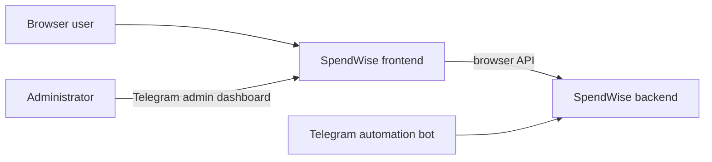

# SpendWise Frontend

The frontend is SpendWise’s browser application. It gives users a web interface for signing in and managing their SpendWise account and financial data, and gives authorized administrators a dashboard for Telegram enrollment.

## Role in the system

The React application communicates with `spendwise-backend` through its browser API. The backend authenticates the user, issues role and scope claims, enforces access, and owns all persistent data. The frontend renders the browser experience and adapts navigation to the permissions returned by the backend.

## Responsibilities

- Provide browser login, registration, session restoration, and account pages.
- Present expense, category, budget, analytics, and profile workflows.
- Present the Telegram admin dashboard for invite creation and pending enrollment review.
- Let an approved Telegram user set web credentials for the SpendWise profile already linked to that Telegram account.
- Keep access tokens in frontend memory and use the backend-managed HttpOnly refresh cookie for session restoration.

## Boundaries

The backend is the security boundary: hiding an admin link or route in the UI does not authorize an operation. Every protected action must be checked by the backend. The frontend must not contain service credentials, Telegram bot secrets, or JWT signing keys.

Telegram webhooks, `/start` and `/setup` command parsing, and agent orchestration belong to `task-automation-bot`. Telegram account mappings and invitation/claim state belong to the backend. Agent-facing business tools belong to `spendwise-mcp`.

