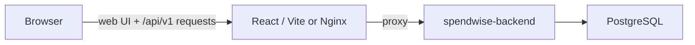

# Spendwise Frontend

React and Vite web application for Spendwise. It provides the browser interface for account login, registration, profile management, expenses, categories, budgets, analytics, and API key management. Telegram enrollment and authorization are handled by `task-automation-bot` and `spendwise-backend`, not by the frontend.

## Architecture

The frontend calls the backend under `/api/v1`. Password and Google sign-in use short-lived access JWTs held in JavaScript memory and an HttpOnly refresh cookie. During local development, Vite proxies `/api/v1` to `http://localhost:8080`. In the Docker image, Nginx proxies `/api/v1/` to `http://host.docker.internal:8080/api/v1/`.



## Run locally

Requires Node.js and npm. From this repository:

```bash
npm install
npm run dev
```

Open the Vite URL, usually `http://localhost:5173`. Start the backend separately on port `8080`.

## Run with Docker

```bash
docker compose up --build
```

Open `http://localhost:5173`. The image builds the static frontend and serves it through Nginx. The Docker proxy expects the backend to be reachable at `host.docker.internal:8080`.

## Environment and API routing

The frontend makes same-origin requests to `/api/v1` and relies on the Vite or Nginx proxy above. `.envExample` contains `VITE_BACKEND_URL`, but the current frontend code does not read that variable; change the proxy configuration if the backend uses a different address. Do not put backend service credentials or Telegram bot secrets in frontend environment variables because browser code is public.

## JWT login and Telegram administration

The frontend keeps the access JWT in memory, attaches it as a bearer token, and asks the backend to rotate the HttpOnly refresh cookie after reload or access-token expiry. The browser does not store tokens in local storage and does not contain signing keys or service credentials.

Users whose backend-issued scopes include `telegram:claims:read` see **Telegram Admin** in the app navigation. The route is guarded in the UI, and each backend admin operation independently checks the necessary scope. Admins can create invitation links and review, approve, or reject enrollment claims at `/app/admin/telegram`.

After a Telegram claim is approved, the user can send `/setup` to the bot and open the one-time password setup link there. The form assigns a username and password to the already-created Spendwise profile so web and Telegram access use the same account.
